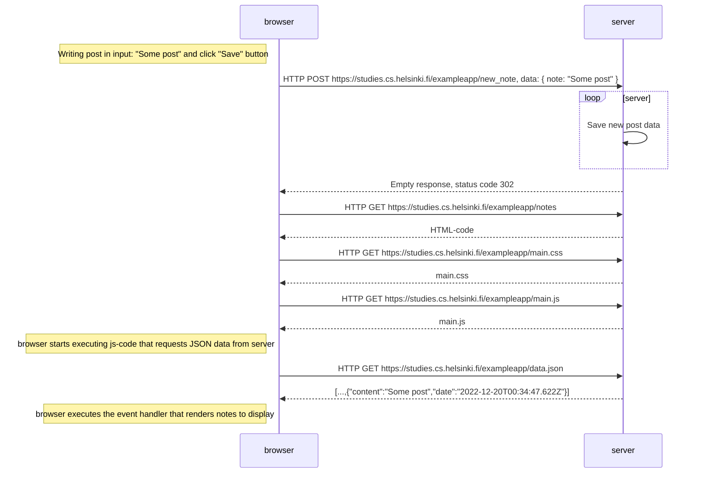

```mermaid
sequenceDiagram
  participant browser
  participant server

Note left of browser: Writing post in input: "Some post" and click "Save" button

browser->>server: HTTP POST https://studies.cs.helsinki.fi/exampleapp/new_note, data: { note: "Some post" }

loop server
  server->>server: Save new post data
end

server-->>browser: Empty response, status code 302
browser->>server: HTTP GET https://studies.cs.helsinki.fi/exampleapp/notes
server-->>browser: HTML-code
browser->>server: HTTP GET https://studies.cs.helsinki.fi/exampleapp/main.css
server-->>browser: main.css
browser->>server: HTTP GET https://studies.cs.helsinki.fi/exampleapp/main.js
server-->>browser: main.js

Note left of browser: browser starts executing js-code that requests JSON data from server

browser->>server: HTTP GET https://studies.cs.helsinki.fi/exampleapp/data.json
server-->>browser: [...,{"content":"Some post","date":"2022-12-20T00:34:47.622Z"}]

Note left of browser: browser executes the event handler that renders notes to display
```
