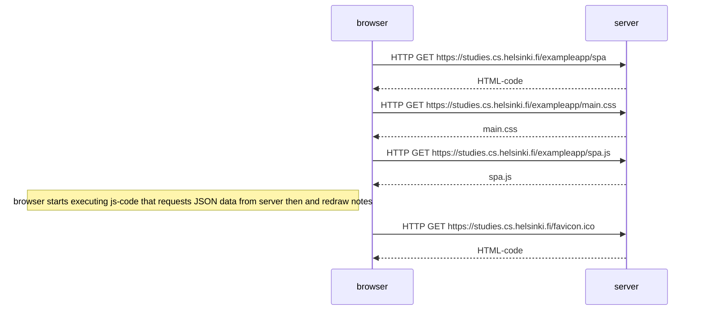

```mermaid
sequenceDiagram
  participant browser
  participant server

browser->>server: HTTP GET https://studies.cs.helsinki.fi/exampleapp/spa
server-->>browser: HTML-code
browser->>server: HTTP GET https://studies.cs.helsinki.fi/exampleapp/main.css
server-->>browser: main.css
browser->>server: HTTP GET https://studies.cs.helsinki.fi/exampleapp/spa.js
server-->>browser: spa.js

Note left of browser: browser starts executing js-code that requests JSON data from server then and redraw notes

browser->>server: HTTP GET https://studies.cs.helsinki.fi/favicon.ico
server-->>browser: HTML-code
```
