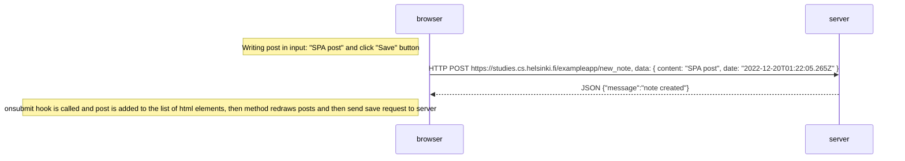

```mermaid
sequenceDiagram
  participant browser
  participant server

Note left of browser: Writing post in input: "SPA post" and click "Save" button

browser->>server: HTTP POST https://studies.cs.helsinki.fi/exampleapp/new_note, data: { content: "SPA post", date: "2022-12-20T01:22:05.265Z" }
server-->>browser: JSON {"message":"note created"}

Note left of browser: onsubmit hook is called and post is added to the list of html elements, then method redraws posts and then send save request to server
```
